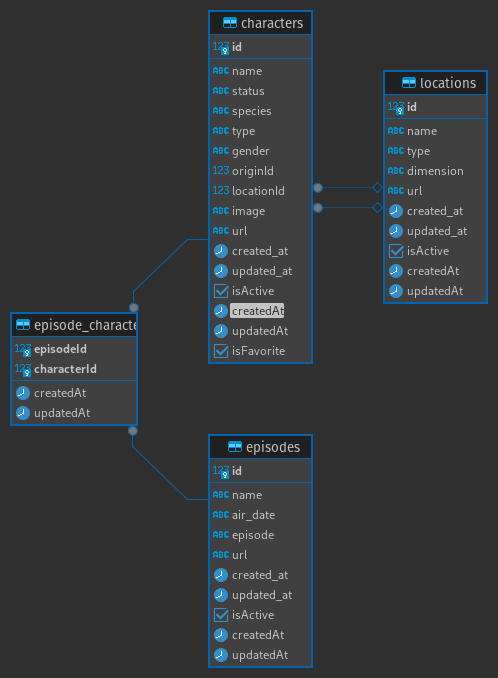

# Rick and Morty API Monorepo

This project is an API and a web application built in a monorepo using NestJS for the backend and Next.js for the frontend.

## Project Structure

.
├── apps
│ ├── api # Backend con NestJS y GraphQL
│ └── web # Frontend con Next.js
├── docker-compose.yml
├── package.json
└── README.md


## Prerequisites

- Node.js (version 14 or higher)
- Docker
- Docker Compose

## Installation

1. Clone the repository:

    ```bash
    git clone <REPOSITORY_URL>
    cd <REPOSITORY_NAME>
    ```

2. Install the dependencies:

    ```bash
    npm install
    ```

3. Run Docker Compose:

    ```bash
    docker-compose up -d
    ```

4. Configure environment variables:

    Create a `.env` file at the root of the project and add the following variables:

    ```env
    # Variables for the backend (apps/api)
    API_PORT=3001
    DATABASE_HOST=localhost
    DATABASE_PORT=5432
    DATABASE_USER=your_user
    DATABASE_PASSWORD=your_password
    DATABASE_NAME=your_database

    # Variables for the frontend (apps/web)
    NEXT_PUBLIC_API_URL=http://localhost:3001/graphql
    ```

## Running

1. Start the project:

    ```bash
    npm run dev
    ```

    The API will be available at `http://localhost:3001/graphql` and the web application at `http://localhost:3000`.

## Usage

### API Endpoints

The API exposes the following endpoints via GraphQL:

- `Query`
  - `characters`: Gets a list of characters.
  - `character(id, status, species, gender, name, originId, isFavorite, comments)`: Gets a character by filter.
- `Mutation`
  - `addComment(id, comment)`: Updates a user's specific comment.
  - `favoriteCharacter(id)`: Changes the character's favorite status.

### Example Queries

- Get all characters:

    ```graphql
    query {
      characters {
        id
        name
        status
        species
        type
        gender
        origin {
            id
            name
        }
        location {
            id
            name
        }
        episodes {
            id
            name
        }
        image
        url
        isFavorite
        comments
      }
    }
    ```

- Get a character by ID:

    ```graphql
    query {
      character(id: "1") {
        id
        name
        status
        species
        gender
        origin {
          name
        }
        location {
          name
        }
      }
    }
    ```

- Change favorite status:

    ```graphql
    mutation {
      favoriteCharacter(id: 1) {
        name
      }
    }
    ```

- Change a character's comment:

    ```graphql
    mutation {
      addComment(id: ${characterId}, comment: "Comment") {
        name
      }
    }
    ```

### Data Modeling


The data modeling was designed as shown above based on how the Rick and Morty API returns the information. A relation table between episodes and characters was created because this relationship was an array of objects.


## Technologies Used

- **Backend**: NestJS, GraphQL, PostgreSQL
- **Frontend**: Next.js, React
- **Monorepo Management**: Turborepo
- **Containers**: Docker, Docker Compose
